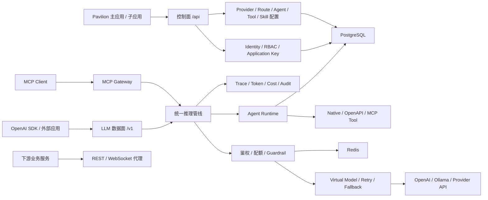

# Pavilion LLM Gateway 重构总计划

> 状态（2026-08-19）：重构与前端切流已完成。`services/llm-gateway` 是唯一后端；
> 旧 `services/platform-api` 和迁移源仓库副本已删除。本文保留架构决策与验收依据，
> “分阶段实施计划”不再代表当前目录中仍需并行维护旧服务。

## 1. 项目目标

以 `nestjs-api-gateway` 作为 PavilionMfe 的统一后端基座，将现有
`pavilion-mfe/services/platform-api` 的功能迁入并逐步升级为 LLM Gateway。

新网关位于 Pavilion 应用和模型 API 之间，统一处理所有出入流量，并集中提供：

- 登录、JWT、角色和应用鉴权；
- 普通 REST、WebSocket 和下游微服务代理；
- LLM Provider、Credential、Model、Virtual Model 和路由管理；
- OpenAI Chat Completions 和 Responses 兼容协议；
- Agent、Tool、Skill 和 MCP 配置；
- Agent 运行时编排、流式输出、取消和状态记录；
- Redis 限流、Token/费用治理、审计和 OpenTelemetry 可观测性。

当前阶段不把各前端子应用拆成独立后端微服务。优先采用“模块化单体 + 可扩展代理”，
在产生明确的性能或隔离需求后再拆服务。

## 2. 已确认决策

| 决策         | 结论                                                      |
| ------------ | --------------------------------------------------------- |
| 网关代码授权 | 允许基于 `nestjs-api-gateway` 复制和修改                  |
| 组织模型     | 第一版只支持单组织，但数据模型预留未来组织/工作区扩展能力 |
| LLM 标准接口 | `/v1/chat/completions` 与 `/v1/responses` 都保留          |
| Skill 存储   | 开发环境使用文件系统；生产环境使用对象存储和不可变版本    |

## 3. 第一批实施范围

第一批只包含：

1. 新网关基座；
2. Pavilion 现有 `/api/*` 接口兼容；
3. OpenAI、OpenAI-compatible 和 Ollama；
4. Virtual Model；
5. 基础 fallback；
6. Agent 版本；
7. stdio、Streamable HTTP MCP；
8. Token 和费用审计。

第一批暂不包含：

- 多组织和复杂租户体系；
- 语义缓存；
- A/B 测试和自适应路由；
- 自动评测、数据集和模型优化；
- 完整 Guardrail 市场；
- 复杂的分布式 Agent 调度；
- 为每个 Pavilion 子应用拆独立微服务。

## 4. 当前项目基线

### 4.1 `nestjs-api-gateway` 可复用能力

- 基于下游 OpenAPI 文档的服务发现和路由白名单；
- HTTP 流式代理和 Undici 连接池；
- WebSocket Upgrade 代理；
- Redis Lua 分布式限流；
- REST 和 WebSocket 请求中间件扩展点；
- 下游 OpenAPI 文档聚合；
- 将下游 REST API 暴露为 MCP Tool；
- OpenTelemetry 基础包。

### 4.2 Pavilion 现有后端能力

`pavilion-mfe/services/platform-api` 当前已经包含：

- 用户注册、登录、JWT 和 RBAC；
- OpenAI、Ollama Provider Adapter；
- Provider 和 Model 管理；
- LangGraph Agent 循环；
- MCP Server 配置、工具同步和调用；
- Skill 本地管理、GitHub 安装和自动选择；
- Chat Thread 和消息保存；
- PostgreSQL、Prisma 和 Redis 基础配置。

本次重构以迁移和重新划分职责为主，不从零重写这些功能。

## 5. 同类项目调研结论

调研项目：

- [LiteLLM](https://github.com/BerriAI/litellm)：统一 OpenAI 协议、Virtual Key、模型权限、预算、消费统计、MCP 和 Agent Gateway；
- [Portkey Gateway](https://github.com/Portkey-AI/gateway)：single、fallback、loadbalance、conditional 路由，以及请求前后 Hook、Guardrail 和缓存；
- [Bifrost](https://github.com/maximhq/bifrost)：Provider、Transport、Store、Plugin 分层，并区分每请求 Hook 和每次 Provider 尝试 Hook；
- [TensorZero](https://github.com/tensorzero/tensorzero)：Gateway、可观测性、评测、反馈和实验闭环。该仓库当前已归档，只借鉴架构思想。

采用以下结论：

1. 控制面和数据面在代码上分离，第一版可部署在同一个 NestJS 进程；
2. 对外提供 OpenAI 兼容协议；
3. Provider、Credential、Model Deployment、Virtual Model 和 Route 分开建模；
4. 所有模型请求经过统一推理管线；
5. Hook 明确区分“每请求执行一次”和“每 Provider 尝试执行一次”；
6. 应用密钥、模型授权、Token 和费用审计是一等能力；
7. 流式响应发出首字节后，不再进行透明 Provider fallback。

## 6. 目标架构



### 6.1 控制面

负责低频管理操作：

- 用户、登录、角色；
- Application 和 Application Key；
- Provider、Credential、Model Deployment；
- Virtual Model 和路由；
- Agent、Tool、Skill、MCP 配置；
- 用量、费用和审计查询。

### 6.2 数据面

负责高频、低开销、支持流式传输的请求：

- `/v1/chat/completions`；
- `/v1/responses`；
- 后续的 `/v1/embeddings`；
- Provider 路由、重试、fallback；
- 流式协议转换；
- Token 和费用采集。

### 6.3 运行时面

负责：

- Agent Version 加载；
- Tool 和 Skill 绑定；
- MCP Tool 调用；
- Run、RunStep 和事件；
- 最大步骤、超时、取消和工具审批。

## 7. 推荐代码结构

最终建议将基座纳入 Pavilion monorepo：

```text
pavilion-mfe/
  services/
    llm-gateway/
      src/
        bootstrap/
        modules/
          identity/
          application/
          provider/
          model-routing/
          inference/
          conversation/
          agent/
          tool/
          skill/
          mcp/
          usage/
          audit/
  packages/
    llm-gateway-core/
    llm-gateway-client/
    llm-gateway-observability/
  services/
```

对应来源：

- `llm-gateway-core`：基于原 `libs/api-gateway`；
- `llm-gateway-client`：基于原 `libs/client`；
- `llm-gateway-observability`：基于原 `libs/opentelemetry`；
- `services/llm-gateway`：基于原网关 `src`，逐步迁入 Pavilion 业务模块。

## 8. 统一推理管线

标准处理顺序：

```text
1. 创建 RequestContext 和 requestId
2. 识别用户 JWT 或 Application Key
3. 校验角色、路由和模型权限
4. 检查 IP、用户、应用、模型、并发和预算
5. 将请求标准化为内部 LLM Request
6. 执行输入 Policy / Guardrail
7. 解析 Virtual Model 和 Routing Policy
8. 选择 Model Deployment
9. 执行 beforeAttempt Hook
10. 调用 Provider Adapter
11. 标准化响应或流式 Chunk
12. 执行 afterAttempt / onStreamChunk Hook
13. 记录 Token、费用、耗时、fallback 和错误
14. 写入 Trace、UsageRecord 和 Audit/Event
```

Hook 生命周期：

- `onRequest`：整个请求执行一次；
- `beforeAttempt`：每次 Provider 或 fallback 尝试前执行；
- `afterAttempt`：每次尝试结束后执行；
- `onStreamChunk`：每个流式 Chunk；
- `onResponse`：最终成功；
- `onError`：最终失败。

## 9. 核心数据模型

| 模型                 | 作用                                          |
| -------------------- | --------------------------------------------- |
| `User`               | 单组织用户                                    |
| `Application`        | Pavilion 子应用或外部调用方                   |
| `ApplicationKey`     | 服务调用密钥，只保存 hash                     |
| `Provider`           | OpenAI、Ollama 等供应商类型                   |
| `ProviderCredential` | 加密存储的 API Key、Header 或云凭证           |
| `ModelDeployment`    | 某 Provider 下的实际模型部署                  |
| `VirtualModel`       | 对外暴露的稳定模型名                          |
| `RoutingPolicy`      | single、weighted、fallback 等策略             |
| `RouteTarget`        | Virtual Model 对应的 Deployment、权重和优先级 |
| `AgentDefinition`    | Agent 逻辑身份和当前版本                      |
| `AgentVersion`       | 不可变 Prompt、模型路由和运行参数             |
| `ToolDefinition`     | native、OpenAPI、MCP Tool                     |
| `AgentToolBinding`   | Agent 可用工具和审批策略                      |
| `Skill`              | Skill 逻辑身份                                |
| `SkillVersion`       | Skill 不可变内容版本                          |
| `AgentSkillBinding`  | Agent 固定或自动选择的 Skill                  |
| `McpServer`          | MCP 连接配置和健康状态                        |
| `Conversation`       | 对话会话                                      |
| `Run`                | 一次 Agent/LLM 运行                           |
| `RunStep`            | 模型调用、工具调用和编排节点                  |
| `UsageRecord`        | Token、费用、Provider、模型和应用用量         |
| `AuditLog`           | 管理操作和敏感配置变更                        |

单组织第一版可以不暴露 Organization API，但建议核心业务表保留可选 `workspaceId` 或
在下一次 schema 大版本中集中加入，避免零散改造。

## 10. 安全要求

### 10.1 密钥

- Provider Credential 使用 AES-GCM Envelope Encryption 或外部 Secret Manager；
- 管理接口永远只返回掩码；
- Application Key 只保存不可逆 hash；
- 密钥仅在 Provider Adapter 调用时解密；
- 日志、Trace、异常和审计信息统一脱敏。

### 10.2 网关边界

- 客户端传入的内部身份头必须删除后重新生成；
- 自定义 Provider URL 和 MCP HTTP URL 必须防 SSRF；
- Skill 名称和文件路径必须规范化并阻止目录穿越；
- MCP stdio command、args、env 只允许管理员配置；
- Tool 使用 allowlist、参数 Schema、结果长度、超时和审批策略。

## 11. API 规划

### 11.1 保持兼容的 Pavilion API

第一阶段保持路径和响应 Envelope 不变：

```text
/api/auth/*
/api/llm/providers/*
/api/llm/models
/api/llm/chat/*
/api/mcp/servers/*
/api/skills/*
```

旧 `/api/llm/chat` 和 `/api/llm/chat/stream` 最终作为兼容 Facade，内部调用统一推理管线。

### 11.2 新增标准数据面 API

```text
GET  /v1/models
POST /v1/chat/completions
POST /v1/responses
POST /v1/agents/{agentId}/runs
GET  /v1/runs/{runId}
POST /v1/runs/{runId}/cancel
POST /mcp
```

后续再增加：

```text
POST /v1/embeddings
POST /v1/images/generations
POST /v1/audio/*
```

## 12. 模块迁移映射

| 现有 Pavilion 模块     | 目标模块               | 第一阶段处理                                     |
| ---------------------- | ---------------------- | ------------------------------------------------ |
| `AuthModule`           | `IdentityModule`       | 先等价迁移 JWT/RBAC                              |
| `LlmProviderService`   | `ProviderModule`       | 先迁移 OpenAI/Ollama，再拆 Credential/Deployment |
| `LlmChatService`       | `InferenceModule`      | 保留旧 API，内部逐步接入统一管线                 |
| `LlmAgentService`      | `AgentRuntimeModule`   | 先迁移现有 LangGraph，再引入 AgentVersion        |
| `AgentToolService`     | `ToolRegistryModule`   | 统一 native、OpenAPI、MCP 来源                   |
| `SkillModule`          | `SkillRegistryModule`  | 保持兼容后增加 SkillVersion                      |
| `McpClientService`     | `McpGatewayModule`     | 改用官方 SDK并支持 stdio/HTTP                    |
| `ChatThreadService`    | `ConversationModule`   | 保持前端契约并逐步关联 Run                       |
| Gateway `ProxyService` | `ServiceGatewayModule` | 保留 REST/WebSocket 代理                         |
| Gateway MCP Server     | `McpExposureModule`    | 与 MCP Client 管理解耦                           |

## 13. 分阶段实施计划

### 阶段 0：建立基线和 ADR

目标：冻结现有行为，确认迁移边界。

任务：

- 记录全部 `/api` 接口、状态码和响应 Envelope；
- 为登录、Provider、Chat SSE、Thread、Skill、MCP 建契约测试；
- 记录 PostgreSQL、Redis 和 Skill 文件迁移方案；
- 确认仓库落点、包名和部署方式；
- 建立 ADR：单组织、双 LLM 协议、Skill 存储和 fallback 规则。

验收：

- 当前前端核心流程有自动化基线；
- 数据库有可恢复备份；
- 后续每项改动有明确的兼容目标。

### 阶段 1：创建新网关基座

目标：让网关同时承载 Pavilion 本地 Controller 和原始流式代理。

任务：

- 创建新的 `services/llm-gateway`；
- 迁入 Gateway Core、Client 和 OpenTelemetry；
- 解决全局 `bodyParser: false` 与本地 `@Body()` Controller 的冲突；
- 只对 `/api` 和需要解析的 `/v1` 路由启用 JSON parser；
- 为 `/api`、`/v1` 和 `/mcp` 建立保留路由；
- 确保 catch-all Proxy 不抢占本地 API；
- 修复可信内部请求头清理；
- 合并本地 Swagger 和下游 OpenAPI；
- 加入 readiness、liveness 和 graceful shutdown。

验收：

- 本地 DTO 和 ValidationPipe 正常；
- 代理请求仍保留原始请求流；
- HTTP、WebSocket、文档和 Redis 限流回归通过。

### 阶段 2：简单迁移旧后端功能

目标：在不升级业务语义的前提下，把 `platform-api` 功能迁到新基座。

迁移顺序：

1. Prisma 和数据库连接；
2. Auth、JWT、RBAC；
3. Provider 和 Model CRUD；
4. Chat 和 Chat Thread；
5. Skill 管理；
6. MCP Server 管理和调用；
7. 现有 LangGraph Agent；
8. 统一响应拦截器和异常格式。

约束：

- 保持 `/api/*` 路径不变；
- 保持前端使用的响应 Envelope 不变；
- 不在本阶段引入 Virtual Model 或新路由策略；
- 不修改主应用和 `ai-chat` 的业务逻辑；
- 每迁移一个模块就完成构建、契约测试和一次冒烟验证。

验收：

- `main-app` 可登录并管理 Provider、MCP 和 Skill；
- `ai-chat` 可加载模型、创建会话并流式聊天；
- 旧数据库数据可以原地使用；
- 迁移期保留旧 `platform-api` 的回滚能力；完成切流验收后删除。

### 阶段 3：身份和 Secret 安全加固

目标：把迁移后的认证升级为网关级统一身份能力。

任务：

- JWT Guard 和代理 Middleware 共用 Identity Service；
- 新增 Application 和 ApplicationKey；
- Provider Credential 加密并对接口脱敏；
- 增加 Provider/MCP URL SSRF 防护；
- 增加 Skill 路径穿越防护；
- 增加敏感日志统一脱敏。

验收：

- 普通用户不能访问管理写接口；
- 客户端无法伪造内部身份头；
- 数据库查询和 API 响应不暴露明文 Provider Key。

### 阶段 4：实现标准 LLM 数据面

目标：提供 OpenAI-compatible LLM Gateway。

任务：

- 定义内部统一 LLM Request、Response、StreamChunk 和 Error；
- 实现 `/v1/chat/completions`；
- 实现 `/v1/responses`；
- 建立 Provider Adapter 能力声明；
- 迁移 OpenAI、OpenAI-compatible、Ollama；
- 统一错误和 Usage 提取；
- 将旧 `/api/llm/chat*` 改为兼容 Facade；
- 支持客户端断开后的下游取消。

验收：

- OpenAI Node SDK 只修改 `baseURL` 即可调用；
- Chat Completions 和 Responses 都支持非流式与流式；
- OpenAI 和 Ollama 返回统一语义；
- 断开客户端后下游请求被取消。

### 阶段 5：Virtual Model 和基础 fallback

目标：让前端和外部应用不再直接选择 Provider ID 与 Model ID。

任务：

- 新增 ModelDeployment、VirtualModel、RoutingPolicy、RouteTarget；
- 实现 single 和 ordered fallback；
- 增加 timeout、retry 和基础 circuit breaker；
- 记录每次 Provider Attempt；
- 明确错误分类：可重试、可 fallback、直接失败；
- 流式响应只允许在发送首字节前 fallback。

验收：

- 客户端通过稳定 Virtual Model 名调用；
- 首选 Provider 失败时按顺序 fallback；
- 权限和客户端错误不触发 fallback；
- 每次尝试可通过 Trace 和 Usage 查询。

### 阶段 6：Agent Version、Tool、Skill 和 MCP

目标：把现有全局自动装配升级为按 Agent 配置。

任务：

- 新增 AgentDefinition 和不可变 AgentVersion；
- AgentVersion 固定 Virtual Model、Prompt 和运行参数；
- Tool 统一成 native、OpenAPI 和 MCP 三类；
- 新增 AgentToolBinding 和 Tool allowlist；
- Skill 增加不可变版本和 AgentSkillBinding；
- MCP 改用官方 SDK；
- 支持 stdio 和 Streamable HTTP；
- 网关作为 MCP Client 和 MCP Server 的职责分离；
- 增加 MCP 进程重启、超时、并发和空闲回收。

验收：

- 不同 Agent 可以使用不同模型、Tool 和 Skill；
- 未绑定 Tool 不能被模型调用；
- Agent 每次 Run 固定使用一个 AgentVersion；
- MCP 进程异常不会拖垮网关；
- Tool 调用全程可审计。

### 阶段 7：运行时编排

目标：Agent 运行具备状态、取消和完整追踪。

任务：

- 新增 Run、RunStep 和 RunEvent；
- 记录模型调用、Tool Call、Tool Result 和错误；
- 增加最大步骤、总超时和单工具超时；
- 支持运行取消；
- 使用统一 SSE Run Event；
- 增加需要人工确认的 Tool Call 状态；
- 长任务产生后再引入 Redis Queue/Worker，普通聊天先保持进程内执行。

验收：

- 页面刷新后可重新读取完整 Run；
- 停止生成能够取消模型和工具请求；
- 任意 Run 可定位其 Agent、Skill、Tool、Virtual Model 和实际 Provider 版本。

### 阶段 8：Token、费用和可观测性

目标：具备第一版可运营能力。

任务：

- 为模型建立 Token 计价配置；
- 记录 input、output、cached 和 reasoning token；
- 记录估算费用、实际 Provider、Virtual Model 和 Application；
- 增加按用户、应用、模型和时间查询用量的接口；
- 扩展 Redis 限流到用户、Application Key、Virtual Model 和并发；
- OpenTelemetry 增加 Provider Attempt、Agent Step 和 Tool Call Span；
- 记录 TTFT、总耗时、fallback 次数和错误类型；
- 管理变更写入 AuditLog。

验收：

- 任意请求可通过 requestId/runId 还原链路；
- 能按用户、应用和模型统计 Token 与费用；
- 流式和非流式请求用量都能正确结算；
- Provider、Redis、PostgreSQL 和 MCP 异常有明确日志和指标。

### 阶段 9：前端切流和旧服务下线

任务：

- 将 Vite `/api` 代理切到新 LLM Gateway；
- 先灰度管理 API，再灰度 Chat；
- 对比旧、新服务的响应和 Usage；
- 保留旧 `platform-api` 回滚窗口；
- 完成回滚演练；
- 稳定后删除旧后端部署和重复代码；
- 更新 Docker Compose、开发脚本和部署文档。

验收：

- `main-app` 和 `ai-chat` 全流程通过；
- 旧服务无业务流量；
- 回滚演练完成；
- 数据迁移和清理记录完整。

## 14. 测试计划

### 14.1 基线和契约测试

- 登录、注册和 Profile；
- Provider、Model CRUD；
- Chat SSE；
- Chat Thread 和消息；
- Skill CRUD、文件读取和远程安装；
- MCP 配置、同步和调用；
- 现有前端响应 Envelope。

### 14.2 网关和协议测试

- 本地 JSON Controller 与原始流式代理并存；
- HTTP、WebSocket、重定向和 Header；
- OpenAI Chat Completions；
- OpenAI Responses；
- SSE 分片、客户端断开和取消；
- Virtual Model、retry 和 fallback；
- fallback 首字节边界。

### 14.3 安全测试

- JWT、RBAC 和 Application Key；
- 伪造可信内部请求头；
- Provider/MCP URL SSRF；
- Skill 文件路径穿越；
- 密钥在 API、日志和 Trace 中的泄漏；
- 未授权 Tool 和 MCP 调用。

### 14.4 故障和性能测试

- Provider timeout、429、5xx 和断流；
- Redis 不可用；
- PostgreSQL 不可用；
- MCP 子进程退出和 HTTP MCP 超时；
- 长连接数量、TTFT、吞吐和内存；
- fallback 和 Tool Loop 最大递归限制。

## 15. 每一步执行约束

为保证不偏差，所有实施步骤遵循：

1. 一次只迁移或新增一个明确能力；
2. 开始前说明本步范围和不会做的内容；
3. 优先补测试或定义可验证验收条件；
4. 不顺便重构无关代码；
5. 保持旧 API 契约直到前端主动迁移；
6. 数据结构采用新增和兼容迁移，不直接破坏已有数据；
7. 每步完成后执行构建、单元测试、契约测试和必要冒烟测试；
8. 每步单独提交，保证可回滚；
9. 发现需要扩大范围时先更新计划，不静默扩展；
10. 旧 `platform-api` 仅在切流和回滚演练期间保留，验收完成后删除。

## 16. 完成后的维护基线

1. `services/llm-gateway` 是唯一后端实现，不再增加旧服务兼容分支；
2. `pnpm dev` 同时启动网关、主应用和子应用，`pnpm dev:service` 可单独启动网关；
3. Provider 密钥只存储于 `ProviderCredential.encryptedPayload`，不保留明文兼容列；
4. Agent 配置只写入不可变 `AgentVersion`，不回写旧的可变 Agent 字段；
5. 每次数据结构变更后执行 Prisma 校验、迁移、seed、契约测试和前端联调。
