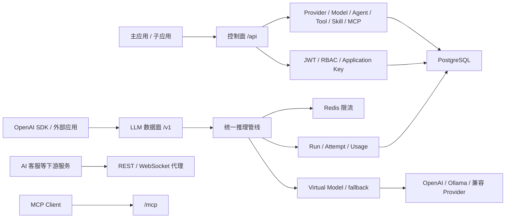

# Pavilion LLM Gateway 重构结果与维护基线

> 状态：重构和前端切流已完成。本文按当前代码记录落地结果；旧的阶段性待办不再作为事实来源。

## 结果摘要

`services/llm-gateway` 已成为 Pavilion 的唯一统一后端，旧 `services/platform-api` 不再存在。当前实现采用“模块化单体 + 可扩展下游代理”：控制面、LLM 数据面、Agent 运行时和 API Gateway 在同一个 NestJS 进程内，下游业务服务可以通过 OpenAPI 与代理配置独立部署。

已落地的主要能力：

- JWT、RBAC、Application 与 Application Key；
- OpenAI、OpenAI-compatible 和 Ollama Provider；
- Provider Credential 加密、模型部署、Virtual Model 与 ordered fallback；
- `/v1/chat/completions` 与 `/v1/responses` 流式/非流式入口；
- Agent Definition、不可变 Agent Version、Tool、Skill 与 MCP 绑定；
- Run、RunStep、RunEvent、Provider Attempt 与 UsageRecord；
- MCP Client、网关 MCP Server、REST/WebSocket 下游代理和 OpenAPI 聚合；
- Redis 限流、AuditLog 与 OpenTelemetry；
- `/health/live` 和依赖感知的 `/health/ready`。

具体启动方式、环境变量和 API 清单见 [`services/llm-gateway/README.md`](./services/llm-gateway/README.md)。

## 当前架构



### 控制面

控制面使用 `/api/*`，主要负责身份、Provider、模型路由、Application、Agent、Tool、Skill、MCP、Usage 和 Audit 管理。平台 Controller 的成功响应统一包装为 `{ code: 0, data, msg: "ok" }`。

### 数据面

数据面使用 `/v1/*`，支持用户 JWT 或 Application Key。请求经过认证、模型授权、限流、Virtual Model 解析、Provider 尝试、fallback、运行记录与用量采集。

### 代理面

`libs/api-gateway` 保留原始请求流以支持 HTTP/WebSocket 代理，根据下游 OpenAPI 文档建立白名单，并可将 REST API 暴露为 MCP Tool。`customer-service` 是当前内置下游示例。

## 已落地数据模型

Prisma Schema 当前包含：

- 身份与调用方：`User`、`Application`、`ApplicationKey`；
- Provider 与路由：`LlmProvider`、`LlmModel`、`ProviderCredential`、`ModelDeployment`、`VirtualModel`、`RoutingPolicy`、`RouteTarget`；
- Agent 与能力：`AgentDefinition`、`AgentVersion`、`ToolDefinition`、`AgentToolBinding`、`Skill`、`SkillVersion`、`AgentSkillBinding`、`McpServer`；
- 运行与治理：`Run`、`RunStep`、`RunEvent`、`ProviderAttempt`、`UsageRecord`、`AuditLog`；
- 兼容聊天：`ChatThread`、`ChatMessage`。

此前计划中的 `Conversation` 最终没有单独建模，代码继续使用 `ChatThread` / `ChatMessage`；文档以实际 Schema 为准。

## 关键架构决策

1. 第一版保持单组织模型，不对外暴露 Organization API。
2. 控制面与数据面在代码中分层，但部署在同一个 NestJS 进程。
3. 同时保留 Chat Completions、Responses 和旧 `/api/llm/chat*` 兼容入口。
4. Provider、Credential、Deployment、Virtual Model 和 Route 分开建模。
5. Provider Credential 使用 AES-256-GCM；Application Key 只保存哈希。
6. 流式输出发出首块后不再透明 fallback。
7. 开发 Skill 使用文件系统，并通过数据库保存元数据和不可变版本。
8. 暂不为了每个前端子应用拆分后端；只有出现明确隔离或容量需求时才新增下游服务。

## 当前限制与后续方向

以下能力不应被文档描述为已实现：

- 多组织/工作区租户；
- 语义缓存；
- A/B 测试、自适应或加权路由的完整运营闭环；
- 自动评测、数据集与模型优化；
- 完整 Guardrail 市场；
- 分布式 Agent 队列/Worker 调度；
- `/v1/embeddings`、图像和音频兼容接口。

后续新增这些能力时，应先补契约和安全边界，再更新本文及服务 README。

## 安全基线

- 生产环境必须提供 `JWT_SECRET`、`CREDENTIAL_ENCRYPTION_KEY` 和 `APPLICATION_KEY_PEPPER`；
- 客户端内部身份头在代理前必须删除并由网关重建；
- Provider/MCP 自定义 URL 必须经过 SSRF 防护；
- Skill 名称和文件路径必须阻止目录穿越；
- 日志、Trace、错误响应和审计记录不得包含明文密钥；
- MCP stdio 配置与管理写接口只允许管理员操作；
- 流式请求必须处理客户端断开和下游取消。

## 验证基线

每次网关修改至少执行：

```bash
pnpm --filter @pavilion-mfe/llm-gateway typecheck
pnpm --filter @pavilion-mfe/llm-gateway build
pnpm --filter @pavilion-mfe/llm-gateway test
pnpm --filter @pavilion-mfe/llm-gateway exec prisma validate
```

涉及代理、鉴权或推理协议时，还要覆盖平台契约、Inference 契约、安全、限流、HTTP/WebSocket 代理和 SSE 边界测试。涉及 Prisma Schema 时必须提供迁移并验证 seed。

## 维护规则

1. `services/llm-gateway` 是唯一平台后端，不恢复旧服务兼容分支。
2. API 行为以 Controller、Guard、DTO、Interceptor 和契约测试为准。
3. 数据语义以 `prisma/schema.prisma` 和迁移为准。
4. 环境变量语义以 `src/config/*.ts` 为准，只提交无真实密钥的 `.env.example`。
5. 变更保持小步、可验证、可迁移；发现范围扩大时先更新设计与验收条件。
